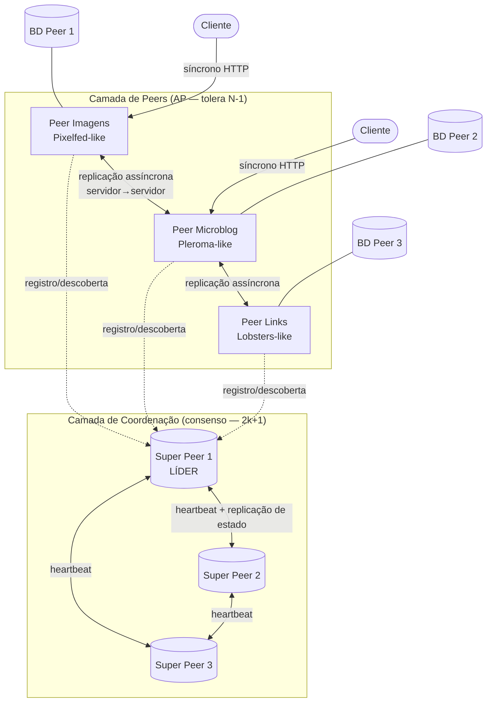
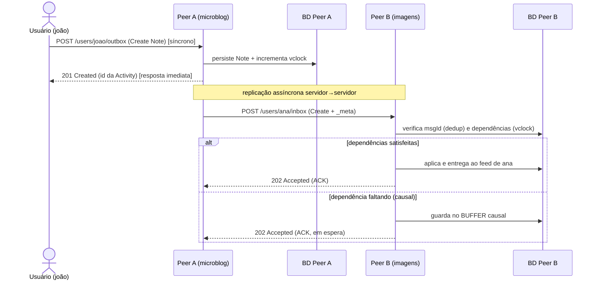
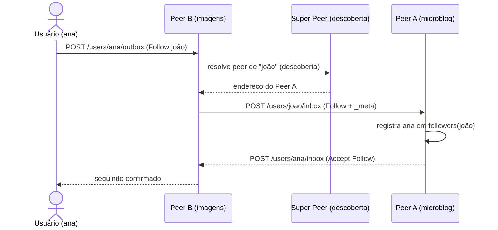
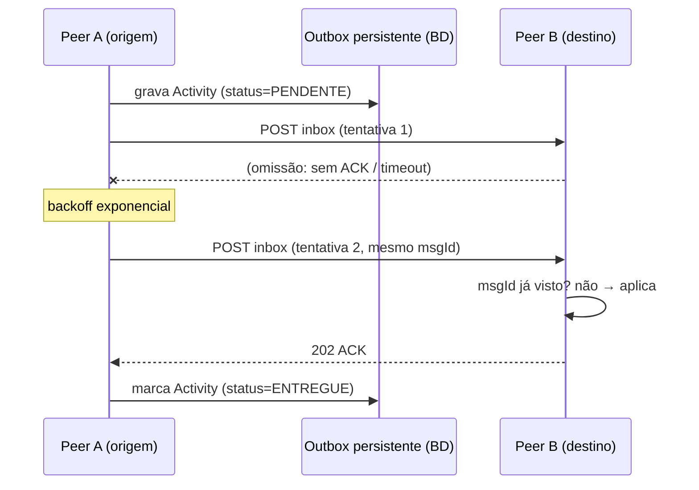
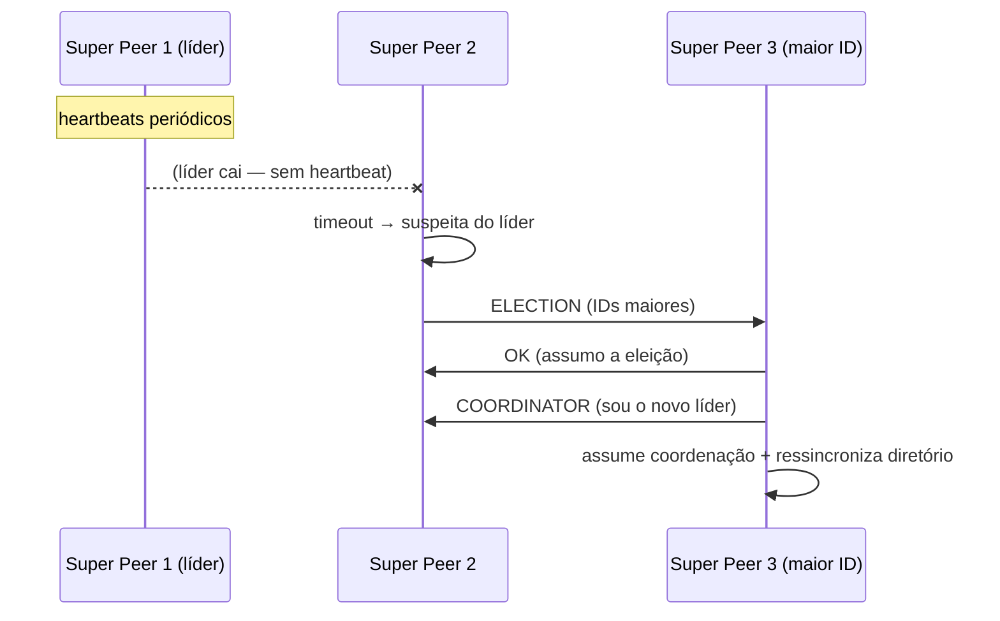

# Renanverse — Fediverse Reduzido

João Fontanezi - 14747191 | Marcos Ruan - 14760209 | André Vieira Rocha - 

O **Renanverse** é um sistema distribuído que implementa um ecossistema social peer-to-peer inspirado no **Fediverse** e no protocolo **ActivityPub**. O objetivo é permitir a comunicação e a **replicação transparente** de dados entre diferentes serviços sociais, sobre uma arquitetura híbrida de **peers** e **super peers**.


Três plataformas interoperáveis compõem a federação:

- **Serviço de imagens** — inspirado em Instagram/Pixelfed
- **Microblogging** — inspirado em Twitter/Pleroma
- **Agregador de links** — inspirado em Lobsters

Postagens, interações e recursos são replicados entre os serviços de forma transparente ao usuário.

> Disciplina associada: **ACH2147** (Sistemas Distribuídos).

## Objetivos

- Implementar um ecossistema distribuído baseado no conceito de Fediverse
- Permitir interoperabilidade entre diferentes tipos de serviços sociais
- Garantir replicação transparente de dados entre peers
- Utilizar um modelo híbrido com peers e super peers
- Simular um protocolo inspirado no ActivityPub

---

## 1. Arquitetura

O sistema é composto por dois papéis:

- **Peers:** serviços independentes que representam as plataformas sociais. Cada peer é autônomo, stateless na camada de aplicação, e possui seu próprio banco de dados.
- **Super Peers:** nós de coordenação responsáveis por **descoberta** (diretório de quem hospeda quem), **roteamento da replicação** e **coordenação** (eleição de líder, ordenação auxiliar). São replicados para tolerância a falhas.

A comunicação ocorre via HTTP/HTTPS sobre TCP.



### Características da arquitetura

- Comunicação **cliente-servidor síncrona** (requisição/resposta imediata)
- Comunicação **servidor-servidor assíncrona** (replicação federada)
- **JSON** como formato de troca de mensagens
- Modelo de objetos do **Activity Streams**

---

## 2. Modelo de Dados (Activity Streams)

As mensagens seguem o padrão **Activity Streams 2.0**. As entidades centrais são **Actor** (`Person`), **Object** (conteúdo: post, imagem, link) e **Activity** (ação sobre um objeto: criar, seguir, curtir).

Exemplo de **Actor** (`Person`):

```json
{
  "@context": ["https://www.w3.org/ns/activitystreams"],
  "type": "Person",
  "id": "https://imagens.renanverse.org/users/ana",
  "preferredUsername": "ana",
  "name": "Ana Souza",
  "summary": "Fotógrafa amadora",
  "inbox": "https://imagens.renanverse.org/users/ana/inbox",
  "outbox": "https://imagens.renanverse.org/users/ana/outbox",
  "followers": "https://imagens.renanverse.org/users/ana/followers",
  "following": "https://imagens.renanverse.org/users/ana/following",
  "icon": ["https://imagens.renanverse.org/media/ana/avatar.png"]
}
```

---

## 3. Catálogo de Mensagens (tipos de Activity)

Toda interação no Renanverse é uma **Activity**. A tabela abaixo lista os tipos suportados, a direção em que trafegam e se geram replicação federada (servidor→servidor).

| Tipo | Descrição | Cliente→Servidor | Servidor→Servidor | Objeto alvo |
|------|-----------|:---:|:---:|---|
| `Create` | Cria um post/imagem/link | ✅ | ✅ (replica p/ seguidores) | `Note`, `Image`, `Page` |
| `Update` | Edita um objeto existente | ✅ | ✅ | objeto existente |
| `Delete` | Remove um objeto (tombstone) | ✅ | ✅ | objeto existente |
| `Follow` | Solicita seguir um Actor | ✅ | ✅ (entrega ao peer do alvo) | `Person` |
| `Accept` / `Reject` | Resposta a um `Follow` | — | ✅ | `Follow` |
| `Like` | Curte um objeto | ✅ | ✅ | objeto |
| `Announce` | Compartilha/repost (boost) | ✅ | ✅ | objeto |
| `Undo` | Desfaz `Like`/`Follow`/`Announce` | ✅ | ✅ | Activity anterior |
| `Mention` | Menciona usuário de outro peer | (embutida em `Create`) | ✅ | `Person` |

### Metadados de controle (todas as mensagens servidor→servidor)

Além do corpo Activity Streams, **toda mensagem de replicação** carrega um envelope de controle usado para confiabilidade e ordenação causal:

```json
{
  "activity": { "type": "Create", "id": "...", "actor": "...", "object": { } },
  "_meta": {
    "msgId": "01HZX9K3M8...",          // ULID único — idempotência/dedup
    "origin": "https://microblog.renanverse.org",
    "vclock": { "microblog": 42, "imagens": 17 },  // relógio vetorial
    "inReplyTo": "01HZX9K2....",       // dependência causal (se houver)
    "ts": "2026-06-29T12:00:00Z"       // timestamp do servidor de origem
  }
}
```

Os campos `msgId`, `vclock` e `inReplyTo` são o que permite **deduplicação** (omissão) e **reordenação causal** (ver seção 6.6).

### Exemplo — `Create` de um post de microblog

```json
{
  "@context": ["https://www.w3.org/ns/activitystreams"],
  "type": "Create",
  "id": "https://microblog.renanverse.org/activities/01HZX9K3M8",
  "actor": "https://microblog.renanverse.org/users/joao",
  "published": "2026-06-29T12:00:00Z",
  "to": ["https://microblog.renanverse.org/users/joao/followers"],
  "object": {
    "type": "Note",
    "id": "https://microblog.renanverse.org/notes/01HZX9K3M8",
    "content": "Olá, fediverso! @ana@imagens.renanverse.org",
    "attributedTo": "https://microblog.renanverse.org/users/joao",
    "tag": [{ "type": "Mention", "href": "https://imagens.renanverse.org/users/ana" }]
  }
}
```

---

## 4. Interações e Diagramas de Sequência

### 4.1 Criar post e replicar para seguidores (caminho feliz)



### 4.2 Seguir um usuário de outro peer (Follow/Accept)



### 4.3 Falha de omissão e recuperação por retry/ACK



### 4.4 Queda do super peer líder e nova eleição (Bully)



---

## 5. Comunicação

- **Protocolo:** HTTP/HTTPS
- **Transporte:** TCP
- **Métodos:** `GET` (leitura de recursos) e `POST` (entrega em `inbox`/`outbox`)
- **Formato:** JSON (Activity Streams + envelope `_meta`)

### Tipos de interação

- **Cliente → Servidor:** síncrona (o usuário recebe resposta imediata; ver 4.1)
- **Servidor → Servidor:** assíncrona, para replicação federada (entrega via `inbox`, com ACK + retry)

---

## 6. Decisões de Projeto (Sistemas Distribuídos)

### 6.1 Quais recursos precisam ser nomeados/identificados?

Usuários (`Person`), postagens (`Activities`/`Objects`), serviços (peers e super peers), relacionamentos (`followers`/`following`) e mídia (imagens, links). Todos recebem um **identificador global único** em forma de **URL**, conforme o Activity Streams.

### 6.2 Qual esquema de nomeação?

Esquema **hierárquico baseado em URLs HTTP/HTTPS**: `https://{peer}/users/{id}`, `.../inbox`, `.../outbox`, `.../followers`. O domínio identifica o peer; o caminho identifica o recurso dentro dele. Isso dá unicidade global e interoperabilidade.

### 6.3 Qual mecanismo de resolução de nomes?

Resolução em camadas, da URL ao objeto concreto:

1. **DNS** — resolve o domínio do peer (`microblog.renanverse.org`) para o IP do servidor.
2. **HTTP/HTTPS** — transporta a requisição até o peer.
3. **Roteamento da aplicação** (antes chamado "roteamento interno") — **dentro do peer**, mapeia o *caminho* da URL para o handler/controller responsável. Ex.: `GET /users/ana/inbox` → controller de inbox do usuário `ana`. É o passo que traduz "qual URL" em "qual pedaço de código + qual consulta ao BD". *Esclarecimento pedido pela banca (semana 2): não é um roteamento de rede entre máquinas, e sim o roteamento de requisição→handler interno do serviço web.*
4. **Banco de dados** — o handler consulta o BD para materializar o objeto (post, perfil) a partir do identificador.

Para nomes em **outro peer** (ex.: seguir `@joão@microblog`), entra a **descoberta via super peer**: o peer consulta o diretório do super peer para obter o endereço do peer que hospeda o recurso (ver 4.2).

### 6.4 Faz sentido usar threads?

Sim. **Uma thread/tarefa por conexão** organiza o código e facilita o compartilhamento de recursos. É o padrão para servidores web de serviços sociais sem interação em tempo real (diferente de streaming/jogos/chat). Mesmo sem aumentar a vazão bruta, é adequado ao perfil de carga da aplicação. (Em Node.js/TypeScript, o modelo é *event loop* assíncrono + workers, equivalente em efeito a "uma tarefa lógica por requisição".)

### 6.5 Servidores stateless ou stateful?

**Stateless** na camada de aplicação: nenhuma sessão é mantida entre requisições. O estado real (posts, perfis, relações) vive no **banco de dados acoplado** ao peer. Respostas são reproduzíveis para qualquer cliente, o que permite **escalar horizontalmente** com réplicas atrás de um balanceador.

### 6.6 Sincronização e Ordenação Causal

A banca está **correta**: um relógio lógico, sozinho, **não garante a entrega ordenada** — ele apenas *detecta* a relação causal (happens-before) entre eventos. Garantir que o usuário **veja** os eventos na ordem causal exige três peças combinadas:

1. **Relógio vetorial** (`vclock` no `_meta`): cada peer mantém um contador por origem. Ao emitir, incrementa o próprio; ao receber, registra o vetor da mensagem. Isso permite ao destino saber se já processou **todas as dependências** de uma mensagem.
2. **Buffer causal (hold-back queue):** se chega uma Activity cujo `vclock`/`inReplyTo` aponta para um evento ainda **não recebido** (ex.: a resposta chegou antes do post original, por causa de omissão/latência), ela **não é entregue** — fica retida no buffer até a dependência chegar.
3. **Papel do super peer:** o super peer atua como **ponto de ordenação e roteamento auxiliar**. Como toda replicação relevante passa pela sua coordenação de descoberta, ele ajuda a estabelecer uma referência consistente de origem/destino e pode **sequenciar** entregas para um mesmo grupo de seguidores, reduzindo divergência. Ele **não** substitui o relógio vetorial — os dois se complementam.

Pseudocódigo da recepção causal no destino:

```text
ao receber mensagem m com m._meta.vclock = Vm de origem j:
    se m.msgId já processado:            # idempotência (omissão/retry)
        descarta e responde ACK
    senão se dependências(Vm) satisfeitas pelo Vlocal:
        aplica(m); Vlocal = max(Vlocal, Vm); ACK
        reavalia BUFFER (pode liberar mensagens que esperavam m)
    senão:                               # falta dependência causal
        BUFFER.add(m)                    # hold-back até dependência chegar
        ACK (recebido, em espera)
```

Regra de dependência satisfeita: `Vm[j] == Vlocal[j] + 1` **e** `Vm[k] <= Vlocal[k]` para todo `k ≠ j`.

### 6.7 Exclusão mútua

**Não há necessidade.** Posts e comentários são *append-only* e identificados por **IDs ordenáveis (ULID/Snowflake)** + timestamp do servidor. Exclusão mútua só faria sentido sob **edição concorrente do mesmo recurso**, raro em redes sociais. `Update`/`Delete` resolvem por *last-writer-wins* baseado no relógio.

### 6.8 Eleição de líder (super peer dinâmico)

**Sim, haverá eleição de líder.** Os super peers são **réplicas idênticas**; um deles atua como **líder/coordenador** (mantém o diretório autoritativo de peers e sequencia tarefas críticas). A escolha é **dinâmica** via **Bully Algorithm**:

- **Gatilho:** o líder deixa de emitir heartbeat → os demais detectam por *timeout* e iniciam eleição.
- **Regra:** o super peer de **maior ID** entre os vivos assume como novo coordenador (ver diagrama 4.4).
- **Retorno do antigo líder:** reentra como membro; conforme o Bully, se tiver ID maior, dispara nova eleição e reassume; depois **ressincroniza o diretório** a partir do estado atual.

Isso elimina o ponto único de coordenação e mantém a federação operável mesmo com troca de líder.

### 6.9 PUB/SUB

**Sim.** No peer, notificações em tempo quase real usam *rooms* do **Socket.io** (publisher = `emit()`, subscribers = clientes em `join` que ouvem via `on()`). Para tornar **distribuído entre processos/instâncias**, usa-se o **Redis Adapter**: o Pub/Sub do Redis propaga eventos entre réplicas do mesmo peer, de modo que um usuário conectado à "Instância A" receba eventos publicados na "Instância B".

### 6.10 Replicação e Consistência

**Entidades replicadas:** `Activities`/`Objects` (posts, imagens, links), metadados de `Person`, relacionamentos (`followers`/`following`) e interações (`Like`, `Announce`, comentários).

**Modelo:** **Consistência Causal**, degradando para **Eventual** em operações concorrentes não relacionadas. Garantia central: *nenhum peer exibe a resposta de B antes do post original de A*.

**Distribuição das cópias: dinâmica, por inscrição.** Uma Activity só viaja para os peers que hospedam **seguidores** do autor (modelo *fan-out on write* limitado à lista de `followers`). Isso evita replicação total e economiza armazenamento/tráfego.

**Protocolo concreto (implementação própria):**

1. **Origem** persiste a Activity, incrementa seu componente no `vclock`, grava na **outbox durável** (status `PENDENTE`) e dispara `POST` para a `inbox` de cada peer com seguidores.
2. **Entrega confiável at-least-once:** cada `POST` espera **ACK**; sem ACK no `timeout`, reenvia com **backoff exponencial** (mesmo `msgId`).
3. **Destino** aplica o algoritmo de recepção causal da seção 6.6 (dedup por `msgId` + buffer por `vclock`).
4. **Convergência:** `Update`/`Delete` usam *last-writer-wins* pelo relógio; **anti-entropy** periódico (puxar `outbox` desde o último `vclock` conhecido) fecha lacunas de omissão silenciosa.

Formato de versionamento embutido no JSON da mensagem: campo `_meta.vclock` (relógio vetorial) + `_meta.inReplyTo` (dependência causal explícita), conforme exemplos da seção 3.

---

## 7. Tolerância a Falhas

### 7.1 Disponibilidade vs. confiabilidade

Prioriza-se **disponibilidade**. Numa rede social federada, o usuário precisa sempre poder postar/ler/interagir, ainda que um peer remoto esteja fora do ar — é aceitável que conteúdo de outro servidor demore a aparecer, mas não que o serviço inteiro trave. Coerente com **consistência causal/eventual** + **replicação assíncrona**.

Por camada:

- **Dentro de um peer** (usuário ↔ seu servidor): prioriza **confiabilidade** (operação síncrona crítica).
- **Entre peers** (replicação federada): troca confiabilidade imediata por **disponibilidade + tolerância a partição**.

### 7.2 Tipos de falha a tolerar

Prioridade (nesta ordem): **(1) omissão → (2) crash →** tratamento parcial de **temporal**.

#### (1) Omissão — falha primária

Mensagem que deveria ser entregue não é, sem o nó necessariamente cair. É o caso mais comum na replicação assíncrona servidor→servidor:

- **Omissão de envio** — origem não despacha (rede, fila cheia).
- **Omissão de canal/rede** — pacote se perde em trânsito.
- **Omissão de recepção** — destino recebe mas não processa (sobrecarga, erro ao persistir).

É a mais crítica porque uma omissão silenciosa **quebra a causalidade**. Tratamento (núcleo do projeto): **at-least-once + ACK/retry**, **idempotência por `msgId`**, **buffer causal**, **outbox durável** e **anti-entropy** (seções 6.6 e 7.7).

#### (2) Crash — parada

Peer ou super peer para por completo (processo morre, container reinicia). Coberto por **detecção via heartbeat**, pela **outbox durável** (mensagens aguardam o retorno) e, nos super peers, pela **reeleição de líder**. Modelo **fail-stop** + **crash-recovery**.

#### (3) Temporal — parcial

Nó lento demais (acima do `timeout`) é tratado como suspeito. Não há prazos rígidos (não é tempo real), mas **deadlines** evitam que um nó lento bloqueie a operação.

#### Fora de escopo

- **Falha de resposta** — o nó **responde, porém incorretamente** (distinta de omissão, onde não há resposta, e de crash, onde para). Subtipos:
  - *Falha de valor:* conteúdo errado (JSON corrompido, contador inconsistente, `id` que não corresponde ao objeto pedido).
  - *Falha de transição de estado:* executa a operação errada (rota indevida, aplica a Activity no objeto errado, ignora o método HTTP).

  Assumimos **fail-stop** (sem resposta arbitrária), mas aplicamos defesas baratas para detectar corrupção acidental: **validação de schema** Activity Streams na borda, **checagem de coerência de `id`/URL**, **checksum/tamanho do payload** e **status HTTP**. Respostas *maliciosamente* incorretas exigiriam assinatura criptográfica (ver falha bizantina) — extensão futura.
- **Falha bizantina** (nós maliciosos/arbitrários) — BFT exige `3f+1` nós, caro e fora de escopo. Defesa (assinaturas HTTP, chave pública já prevista em `Person`) fica como extensão futura.

### 7.3 Quantos processos falhantes suportados

A resposta **depende da camada** — e a distinção é exatamente entre "operação sem consenso" e "operação com consenso":

#### Camada de peers — replicação de conteúdo (SEM consenso, AP)

Tolera **N-1 peers caídos**. Não há votação nem quórum: cada peer é autônomo e serve seus próprios usuários. Um peer fora do ar só atrasa a propagação *para* ele; ao voltar, recupera via outbox + anti-entropy. **Aqui a regra N-1 vale porque nenhuma operação exige acordo entre nós.**

#### Camada de super peers — estado coordenado (COM consenso, quórum)

Aqui **há necessidade de consenso** (diretório de peers, líder, sequenciamento). Logo, aplica-se a regra de quórum apontada pela banca:

```
para tolerar k falhas → 2k+1 nós (maioria precisa sobreviver)
```

| Réplicas (N) | Maioria (quórum) | Falhas toleradas (k) |
|:---:|:---:|:---:|
| 1 | 1 | **0** (SPOF) |
| 3 | 2 | **1** |
| 5 | 3 | **2** |
| 7 | 4 | **3** |

**Decisão:** **3 super peers, tolerando 1 falha** (`k=1`). É o menor N que elimina o SPOF; com maioria = 2, sobrevive à queda de 1. A queda de 2 deixa 1 nó sem maioria, que **para de coordenar** para não arriscar inconsistência (escolha CP *dentro* da coordenação). Escalar é só aumentar N conforme `2k+1` (5 → 2 falhas; 7 → 3). Eleição via **Bully** (seção 6.8); evolução para **Raft** se a integridade do estado coordenado exigir log replicado.

> **Meta de tolerância:** **qualquer número de peers** (até restar 1) na camada AP **+ 1 super peer em 3** na camada de consenso (configurável via `2k+1`).

### 7.4 Estratégia de detecção de falhas

**Heartbeat + timeout** (detector por pulso):

- Peers/super peers emitem sinal de vida periódico; super peers trocam heartbeats entre si.
- Sem heartbeat dentro do `timeout` → nó marcado **suspeito**, depois **falho**.
- Na camada HTTP: **timeouts** + **retries com backoff exponencial**; após falhas repetidas, o destino é marcado indisponível e as mensagens vão para a **outbox durável**.

> Em rede assíncrona, detectores são **imperfeitos** (não distinguem "caiu" de "lento"). Daí os estados *suspeito/confirmado* e o `timeout` como trade-off entre detecção rápida e falsos positivos.

### 7.5 Protocolo

1. **Detecção:** heartbeat + timeout (gossip opcional para escalar).
2. **Coordenação dos super peers:** **Bully** (eleição dinâmica de líder); alternativa robusta **Raft** (líder + log replicado + quórum `2k+1`).
3. **Replicação entre peers:** **at-least-once idempotente** — `msgId` (ULID) + `vclock`; reentregas deduplicadas; buffer causal para ordenação.

> Recomendação para o escopo: **Bully + heartbeat + replicação at-least-once idempotente com relógios vetoriais**.

### 7.6 Consequências do teorema CAP

Sob **partição (P)** — inevitável numa federação pela internet — escolhe-se entre **C** e **A**. O Renanverse é **AP** na replicação de conteúdo:

- Durante partição, cada peer **continua aceitando** postagens/interações localmente (disponibilidade).
- Abre-se mão de consistência forte: feeds podem divergir temporariamente.
- Curada a partição, outbox/buffer drenam e os relógios vetoriais garantem **ordem causal** → **consistência eventual com garantia causal**.

A camada de **super peers**, por exigir consenso, é **CP** internamente (sem maioria, suspende a coordenação). Em **PACELC**: sem partição, ainda priorizamos **latência** (replicação assíncrona).

### 7.7 Como recuperar da falha

Recupera primeiro **omissão** (primária), depois **crash**; modelo **crash-recovery**.

#### A. Recuperação de omissão (primária)

1. **At-least-once com ACK + retry:** todo `POST` exige ACK; sem ACK no `timeout`, reenvia com backoff. Cobre omissão de envio/canal/recepção.
2. **Idempotência por `msgId`:** destino guarda IDs processados e descarta duplicatas (at-least-once + idempotência ≈ *exactly-once*).
3. **Buffer causal:** Activity com dependência ausente fica retida até a dependência chegar (não quebra a linha do tempo).
4. **Outbox durável:** mensagens para destinos indisponíveis ficam na fila; drenadas quando o heartbeat reaparece (ver definição de "durável" abaixo).
5. **Anti-entropy / catch-up:** periodicamente, o peer puxa do `outbox` da origem o que falta desde o último `vclock` — rede de segurança contra omissão silenciosa.

#### B. Recuperação de crash

1. **Persistência durável:** estado real no **BD acoplado**; ao reiniciar, o peer recupera tudo do BD e reconcilia via outbox + anti-entropy.
2. **Super peer:** se o líder cai, **Bully** elege novo (basta o quórum sobreviver); ao voltar, o antigo ressincroniza o diretório.
3. **Snapshots/checkpoints (opcional):** acelera restauração após crash longo.

#### O que significa "fila persistida"?

"Persistida" = **gravada em armazenamento durável que sobrevive ao reinício/crash do processo** — não é uma fila apenas em memória RAM (que se perderia no crash). Concretamente, adotamos o padrão **Transactional Outbox**:

- A Activity e seu registro de entrega são **gravados na mesma transação do banco de dados** (tabela `outbox` com colunas `msgId`, `destino`, `payload`, `status`, `tentativas`).
- Um processo *dispatcher* lê linhas `PENDENTE`, envia, e marca `ENTREGUE` ao receber ACK.
- Se o processo morre a qualquer momento, ao reiniciar ele relê a tabela e **retoma as entregas pendentes** — nada se perde.
- Alternativa equivalente: broker com persistência em disco (ex.: Redis com AOF, ou RabbitMQ com filas duráveis). O ponto é **durabilidade em disco**, não o produto específico.

---

## 8. Conceitos Aplicados

Sistemas distribuídos · arquitetura peer-to-peer · modelo super peer · nomeação por URLs globais · comunicação assíncrona servidor-servidor · interoperabilidade · replicação dinâmica por inscrição · relógios vetoriais e ordenação causal · eleição de líder (Bully) · consenso e quórum (`2k+1`) · teorema CAP/PACELC · detecção de falhas por heartbeat · entrega at-least-once idempotente · transactional outbox.

## 9. Referências

- **ActivityPub:** https://www.w3.org/TR/activitypub/
- **Activity Streams 2.0:** https://www.w3.org/TR/activitystreams-core/
- **Fediverse:** https://en.wikipedia.org/wiki/Fediverse
- **Bully Algorithm / Raft / relógios vetoriais / CAP:** literatura de Sistemas Distribuídos (Tanenbaum; Coulouris).
